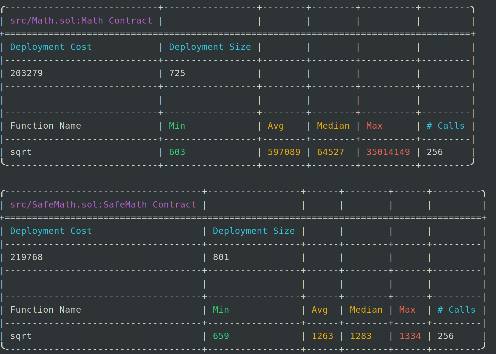

### Foundry 是一个用 Rust 编写的用于以太坊应用程序开发的超快、便携且模块化的工具包,主要功能有

* 编译
```shell
$ forge build
```
* 测试
```shell
$ forge test
```
* 合约部署
```shell
$ forge script script/Counter.s.sol:CounterScript --rpc-url <your_rpc_url> --private-key <your_private_key>
```
* 合约交互
```shell
$ cast <subcommand>
```
* 文档 https://book.getfoundry.sh/

#### 实现数学运算中的开平方根运算，进行gas优化

* 初始版本，src/Math.sol 基于二分查找实现

* 优化版本，调用了OpenZepplin的开平方根实现

* 通过调查发现优化后的gas消耗大幅降低

- [ ] 遗留问题OpenZepplin代码gas消耗为何如此低？
```shell
forge test --gas-report
```
<div align="center">
  
  <br>
  <em>图1: 系统架构图</em>
</div>
