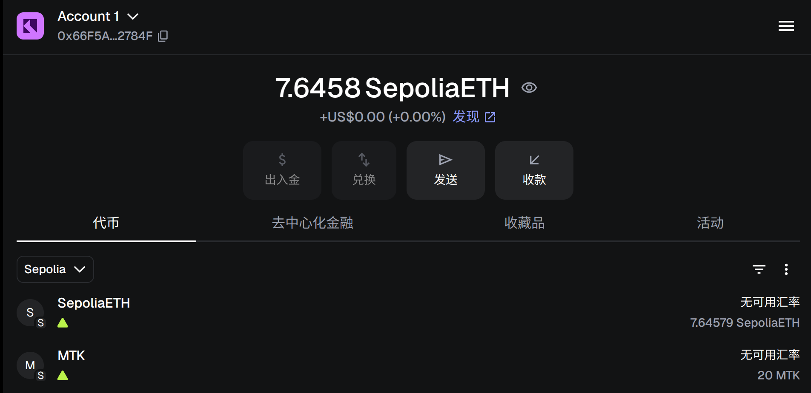
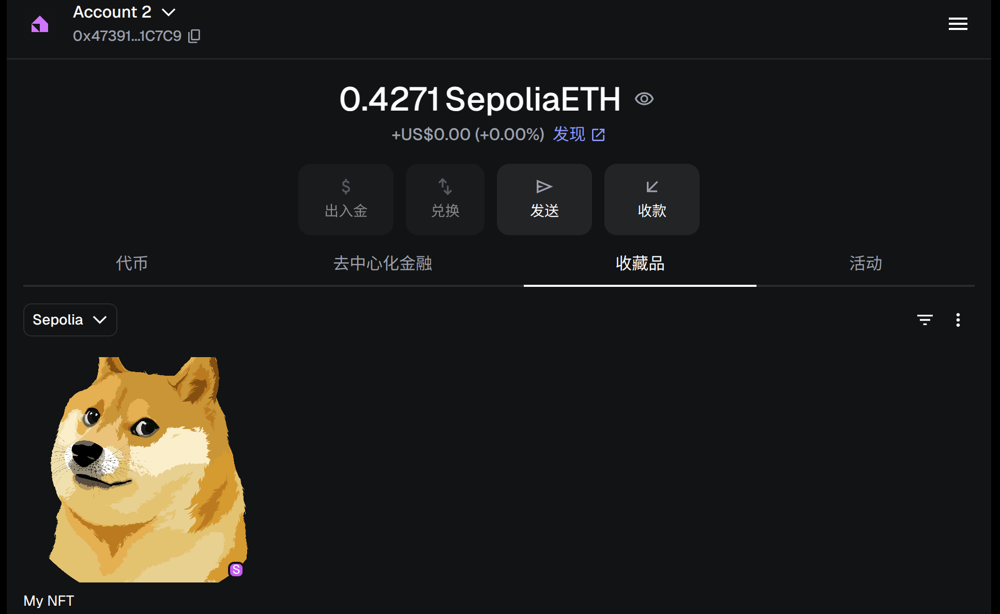
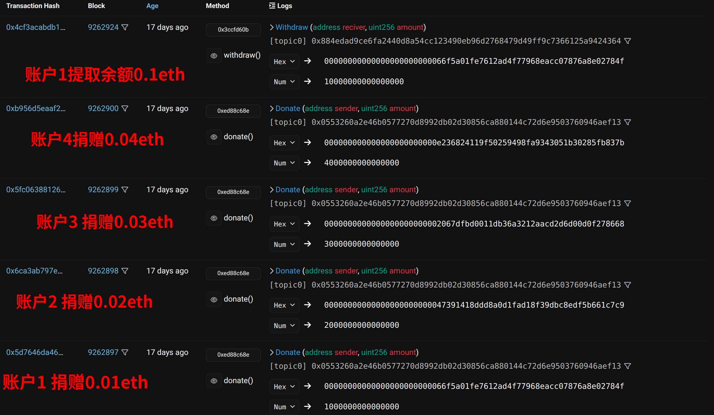

# 作业 1：ERC20 代币
* 代码: contracts/MyToken.sol
* 部署到sepolia测试网： https://sepolia.etherscan.io/address/0xb114cc921e16dEC1C98381f1e1d423dd2D8f5eB2#readContract
* 代币导入MetaMask钱包

  
   
  <em>图1: MyToken 导入MetaMask钱包</em>

# 作业2：在测试网上发行一个图文并茂的 NFT
* 代码： contracts/MyNFT.sol
* 部署到sepolia测试网: https://sepolia.etherscan.io/address/0xEF998ad7aCD1A1b43Ed9D7D72491354Bc462051D#writeContract
* 导入到metamask钱包：

  
   
  <em>图1: NFT 导入MetaMask钱包</em>

# 作业3：编写一个讨饭合约
* 代码: contracts/Begging.sol
* 部署到sepolia测试网：https://sepolia.etherscan.io/address/0xdFFBea6700251b9E44a0dB6F10f73b95cef8e76A#code
* 测试

  
   
  <em>图1: NFT 导入MetaMask钱包</em>

